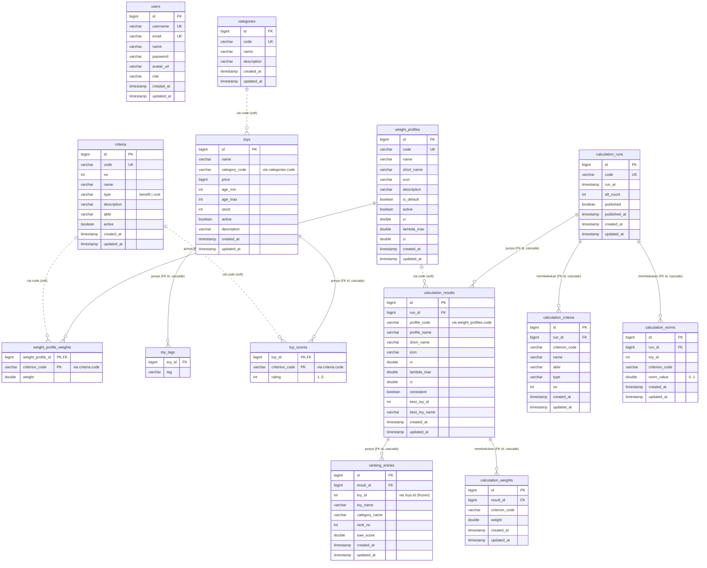

# Struktur Database — SPK Mainan

> Skema dikelola **Flyway** (`BACKEND/src/main/resources/db/migration/V1..V4`) dengan
> `ddl-auto: validate`. Dokumen ini diambil langsung dari migrasi tersebut, jadi selalu sesuai
> dengan yang berjalan. DBMS: **PostgreSQL** (produksi/Docker) · **H2** mode PostgreSQL (dev/test).

## Ringkasan

15 tabel dalam 4 kelompok:

| Kelompok | Tabel |
|---|---|
| **Auth** | `users` |
| **Domain SPK** | `categories`, `criteria`, `weight_profiles`, `weight_profile_weights`, `toys`, `toy_tags`, `toy_scores` |
| **Kalkulasi (arsip/publish)** | `calculation_runs`, `calculation_results`, `ranking_entries` |
| **Snapshot beku (gerbang publish)** | `calculation_criteria`, `calculation_weights`, `calculation_norms` |

### Catatan penting tentang relasi (baca ini dulu)

Ada **dua gaya relasi** di skema ini:

1. **FK id keras (hard FK)** — `REFERENCES … ON DELETE CASCADE`. Dipakai untuk relasi
   induk-anak *milik* (owned): `weight_profiles → weight_profile_weights`, `toys → toy_scores`,
   `calculation_runs → …`, dst. Menghapus induk otomatis menghapus anak.
2. **Tautan lunak lewat `code` (soft link)** — mis. `toys.category_code → categories.code`,
   `toy_scores.criterion_code → criteria.code`, `weight_profile_weights.criterion_code →
   criteria.code`. Ini **bukan** foreign key di level database (tidak ada constraint), tapi tautan
   logis lewat kolom `code`. Alasannya: kode (`edukatif`, `keamanan`, `harga`) bersifat stabil &
   mudah dibaca, dan snapshot kalkulasi perlu membekukan kode tanpa terikat ke baris master yang
   bisa berubah. **Integritasnya dijaga di lapisan aplikasi** (service), bukan constraint DB.

Di ERD, hard FK digambar garis penuh; soft link diberi catatan `(via code)`.

---

## ERD



> Legenda: `||--o{` = relasi FK keras (satu-ke-banyak, cascade). `||..o{` = tautan lunak lewat
> kolom `code` (tanpa constraint DB, dijaga aplikasi).

---

## Penjelasan tiap tabel

### 1. `users` — akun admin (web)
Login web management. Mobile tidak login, jadi tak menyentuh tabel ini.

| Kolom | Tipe | Keterangan |
|---|---|---|
| `id` | BIGINT PK | identitas |
| `username` | VARCHAR(100) **UK** | dipakai untuk login (bukan email) |
| `email` | VARCHAR(255) **UK** | email unik |
| `name` | VARCHAR(255) | nama tampilan |
| `password` | VARCHAR(255) | hash **BCrypt** (tak pernah dikirim ke klien) |
| `avatar_url` | VARCHAR(512) | opsional |
| `role` | VARCHAR(50) | `ADMIN` / `USER` (default `USER`) |

### 2. `categories` — kategori mainan
Atribut pengelompokan & filter (mis. Edukatif, Puzzle). **Bukan** bagian hirarki AHP.

| Kolom | Tipe | Keterangan |
|---|---|---|
| `id` | BIGINT PK | |
| `code` | VARCHAR(50) **UK** | kunci logis, dipakai `toys.category_code` |
| `name` | VARCHAR(255) | nama kategori |
| `description` | VARCHAR(512) | opsional |

### 3. `criteria` — kriteria AHP
10 kriteria default (9 *benefit* + 1 *cost* = `harga`). Bisa ditambah/hapus admin; `harga` dilindungi.

| Kolom | Tipe | Keterangan |
|---|---|---|
| `id` | BIGINT PK | |
| `code` | VARCHAR(50) **UK** | kunci logis (mis. `keamanan`, `harga`) |
| `no` | INTEGER | urutan tampil |
| `name` | VARCHAR(255) | nama kriteria |
| `type` | VARCHAR(20) | **`benefit`** (makin tinggi makin baik) / **`cost`** (makin rendah makin baik) → menentukan normalisasi SAW |
| `abbr` | VARCHAR(50) | singkatan (header matriks pairwise) |
| `active` | BOOLEAN | non-aktif = **dikecualikan** dari AHP-SAW & mobile |

### 4. `weight_profiles` — profil bobot (skenario AHP)
Tiap baris = satu skenario bobot (mis. "Utamakan Keamanan"). Metrik konsistensi hasil pairwise disimpan di sini.

| Kolom | Tipe | Keterangan |
|---|---|---|
| `id` | BIGINT PK | |
| `code` | VARCHAR(50) **UK** | kunci logis (mis. `safety`) — dikirim mobile sebagai `prioritas` |
| `name` / `short_name` / `icon` | VARCHAR | tampilan |
| `is_default` | BOOLEAN | profil default (`balanced`) |
| `active` | BOOLEAN | aktif/arsip |
| `cr` | DOUBLE | **Consistency Ratio** (valid bila ≤ 0,10) |
| `lambda_max` | DOUBLE | λmax hasil AHP |
| `ci` | DOUBLE | Consistency Index |

### 5. `weight_profile_weights` — vektor bobot per profil
Bobot tiap kriteria untuk satu profil (hasil pairwise, Σ = 1). PK gabungan `(weight_profile_id, criterion_code)`.

| Kolom | Tipe | Keterangan |
|---|---|---|
| `weight_profile_id` | BIGINT **PK, FK→weight_profiles** | induk (cascade) |
| `criterion_code` | VARCHAR(50) **PK** | kriteria (soft link ke `criteria.code`) |
| `weight` | DOUBLE | bobot 0..1 |

### 6. `toys` — mainan (alternatif SPK)
Alternatif yang diranking. Harga = kriteria cost; atribut lain untuk tampilan/filter.

| Kolom | Tipe | Keterangan |
|---|---|---|
| `id` | BIGINT PK | |
| `name` | VARCHAR(255) | nama mainan |
| `category_code` | VARCHAR(50) | soft link ke `categories.code` (ada index) |
| `price` | BIGINT | harga (Rp) — nilai untuk kriteria `harga` (cost) |
| `age_min` / `age_max` | INTEGER | rentang usia (filter) |
| `stock` | INTEGER | stok |
| `active` | BOOLEAN | non-aktif = tidak ikut kalkulasi |
| `description` | VARCHAR(512) | opsional |

### 7. `toy_tags` — tag mainan
Label bebas untuk filter mobile (di luar AHP). Banyak tag per mainan.

| Kolom | Tipe | Keterangan |
|---|---|---|
| `toy_id` | BIGINT **FK→toys** | induk (cascade) |
| `tag` | VARCHAR(100) | mis. "Kayu", "Bestseller" |

### 8. `toy_scores` — penilaian 1–5 per kriteria
Matriks keputusan mentah: rating admin untuk tiap mainan × kriteria (kecuali `harga` yang pakai `toys.price`). PK gabungan `(toy_id, criterion_code)`.

| Kolom | Tipe | Keterangan |
|---|---|---|
| `toy_id` | BIGINT **PK, FK→toys** | induk (cascade) |
| `criterion_code` | VARCHAR(50) **PK** | soft link ke `criteria.code` |
| `rating` | INTEGER | nilai **1–5** |

### 9. `calculation_runs` — sesi kalkulasi
Satu kali "Jalankan Kalkulasi". Menyimpan status publish (gerbang ke mobile).

| Kolom | Tipe | Keterangan |
|---|---|---|
| `id` | BIGINT PK | |
| `code` | VARCHAR(20) **UK** | kode sesi (mis. `001`) |
| `run_at` | TIMESTAMP | waktu dijalankan |
| `alt_count` | INTEGER | jumlah mainan aktif saat run (dipakai deteksi "basi") |
| `published` | BOOLEAN | **hanya satu** sesi published pada satu waktu |
| `published_at` | TIMESTAMP | waktu publish (dipakai `/public/meta.lastPublishedAt` & sinyal basi) |

### 10. `calculation_results` — hasil per profil dalam satu sesi
Ringkasan per profil bobot: metrik konsistensi + pemenang. Kolom `short_name`/`icon` ditambahkan V4 (untuk snapshot publik).

| Kolom | Tipe | Keterangan |
|---|---|---|
| `id` | BIGINT PK | |
| `run_id` | BIGINT **FK→calculation_runs** | induk (cascade) |
| `profile_code` / `profile_name` / `short_name` / `icon` | | identitas profil (soft link `weight_profiles.code`) |
| `cr` / `lambda_max` / `ci` / `consistent` | | metrik AHP saat run (beku) |
| `best_toy_id` / `best_toy_name` | | rekomendasi #1 profil ini |

### 11. `ranking_entries` — ranking mainan per profil (beku)
Peringkat + skor SAW tiap mainan dalam satu hasil-profil. **Skor & rank beku** di sini (dasar tampilan Hasil & konsumsi mobile).

| Kolom | Tipe | Keterangan |
|---|---|---|
| `id` | BIGINT PK | |
| `result_id` | BIGINT **FK→calculation_results** | induk (cascade) |
| `toy_id` | INTEGER | id mainan (dibekukan; atribut tampilan dihidrasi live) |
| `toy_name` / `category_name` | | salinan nama saat run |
| `rank_no` | INTEGER | peringkat (1 = terbaik) |
| `saw_score` | DOUBLE | skor SAW `Sᵢ = Σ wⱼ·rᵢⱼ` |

### 12. `calculation_criteria` — kriteria beku (snapshot publish, V4)
Set kriteria **as-of-publish** (kode/nama/abbr/`type`/urutan). `type` dipakai agar normalisasi tetap konsisten walau master kriteria berubah setelah publish. Unik `(run_id, criterion_code)`.

| Kolom | Tipe | Keterangan |
|---|---|---|
| `id` | BIGINT PK | |
| `run_id` | BIGINT **FK→calculation_runs** | induk (cascade) |
| `criterion_code` / `name` / `abbr` / `type` / `no` | | salinan kriteria saat publish |

### 13. `calculation_weights` — bobot beku per profil (snapshot publish, V4)
Vektor bobot AHP yang dibekukan per hasil-profil, agar mobile memakai bobot terpublish (bukan bobot live). Unik `(result_id, criterion_code)`.

| Kolom | Tipe | Keterangan |
|---|---|---|
| `id` | BIGINT PK | |
| `result_id` | BIGINT **FK→calculation_results** | induk (cascade) |
| `criterion_code` | VARCHAR(50) | kriteria |
| `weight` | DOUBLE | bobot beku 0..1 |

### 14. `calculation_norms` — matriks ternormalisasi beku (snapshot publish, V4)
Nilai `r_ij` (0..1) tiap mainan × kriteria hasil normalisasi SAW, dibekukan. Dipakai untuk bar "kenapa peringkat ini", bandingkan, dan sortir per kriteria di mobile. Unik `(run_id, toy_id, criterion_code)`.

| Kolom | Tipe | Keterangan |
|---|---|---|
| `id` | BIGINT PK | |
| `run_id` | BIGINT **FK→calculation_runs** | induk (cascade) |
| `toy_id` | INTEGER | mainan |
| `criterion_code` | VARCHAR(50) | kriteria |
| `norm_value` | DOUBLE | `r_ij` ternormalisasi 0..1 |

---

## Alur data ringkas (mengikat semuanya)

```
Admin input:
  categories, criteria, weight_profiles(+weight_profile_weights), toys(+toy_tags, toy_scores)
        │
        ▼  Pairwise (AHP) → isi weight_profile_weights + cr/lambda/ci di weight_profiles
        ▼  Jalankan Kalkulasi (SAW) →
              calculation_runs
                ├─ calculation_results ─ ranking_entries        (ringkasan + ranking)
                ├─ calculation_criteria                          (kriteria beku)      ┐
                ├─ calculation_weights (per result)              (bobot beku)         ├ snapshot publish
                └─ calculation_norms                             (r_ij beku)          ┘
        │
        ▼  Publikasikan (set published=true pada satu run)
        ▼
Mobile (publik) membaca run terpublish terbaru:
  skor/rank ← ranking_entries · bobot ← calculation_weights · r_ij ← calculation_norms
  kriteria ← calculation_criteria · atribut mainan (nama/harga/stok) ← toys (live per toy_id)
```

> Detail metode & alur sistem: lihat [`ALUR_SISTEM.md`](ALUR_SISTEM.md).
