# Diagram Bab III — Aplikasi KIDORA (Mermaid)

> Semua diagram di bawah ditulis dalam **Mermaid** dan dapat diekspor menjadi PNG.
> **Cara ekspor ke PNG:**
> 1. Buka <https://mermaid.live> → tempel kode di dalam blok ```mermaid ... ```
>    → menu **Actions → PNG** (atau SVG).
> 2. Atau di **VS Code**: pasang ekstensi *Markdown Preview Mermaid Support* / *Mermaid Editor*,
>    lalu klik kanan diagram → export.
> 3. GitHub merender blok `mermaid` otomatis jadi gambar (bisa di-screenshot).
>
> Catatan: Use Case Diagram bukan tipe native Mermaid, jadi didekati dengan diagram graf
> (aktor — elipsUse case). Kalau butuh notasi UML use case yang persis, gambar ini bisa jadi
> acuan untuk digambar ulang di draw.io/Lucidchart.

---

## Gambar 3.1 — Tahap Penelitian

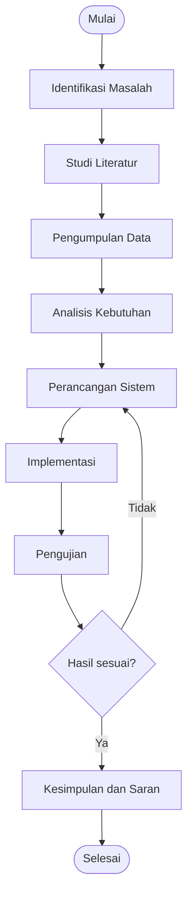

---

## Gambar 3.2 — Struktur Informasi Aplikasi KIDORA (User / Mobile)

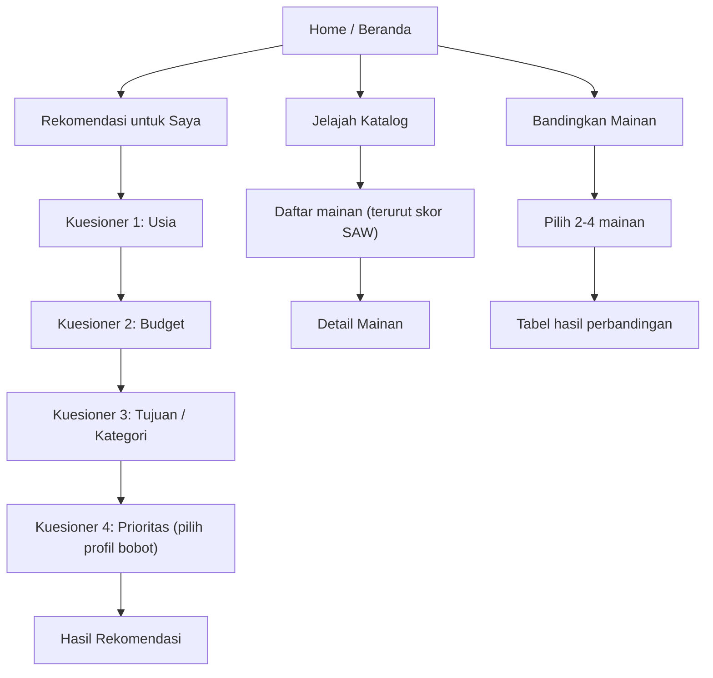

---

## Gambar 3.3 — Struktur Informasi Admin (Web)

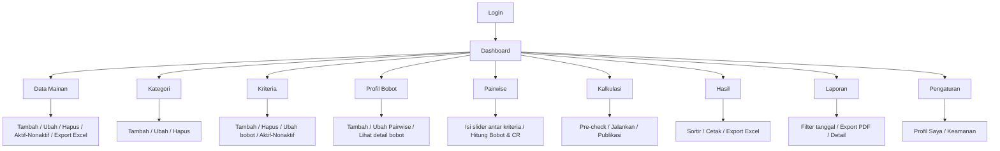

---

## Gambar 3.4 — Use Case Diagram (User)

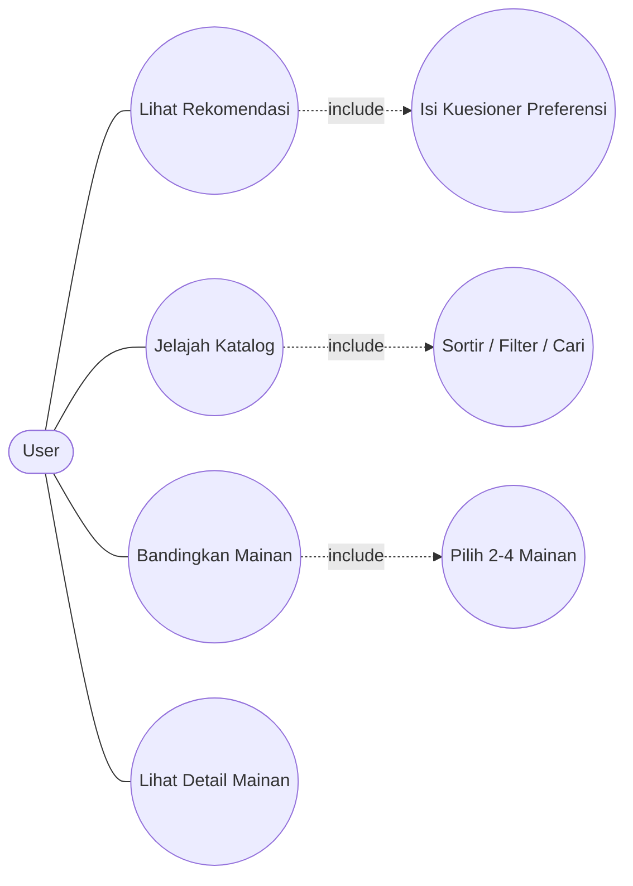

---

## Gambar 3.5 — Use Case Diagram (Admin)

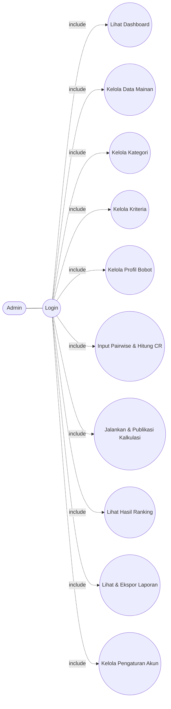

---

## Gambar 3.6 — Activity Diagram User: Rekomendasi untuk Saya

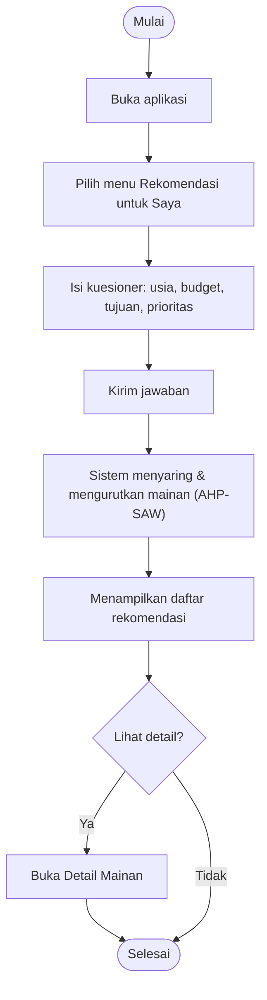

---

## Gambar 3.7 — Activity Diagram User: Jelajah Katalog

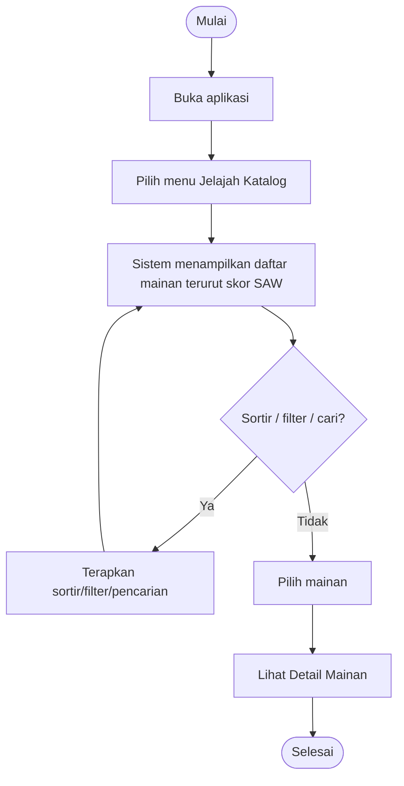

---

## Gambar 3.8 — Activity Diagram User: Bandingkan Mainan

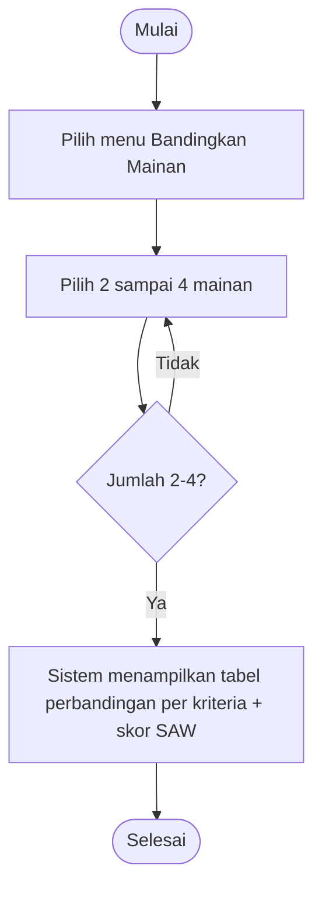

---

## Gambar 3.9 & 3.14 — Activity Diagram Admin: Menambahkan Data (Mainan / Kategori)

> Alur ini berlaku untuk **Tambah Mainan** (Gambar 3.9) dan **Tambah Kategori** (Gambar 3.14).

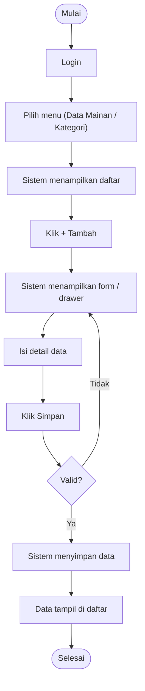

---

## Gambar 3.10 & 3.15 — Activity Diagram Admin: Mengubah Data (Mainan / Kategori)

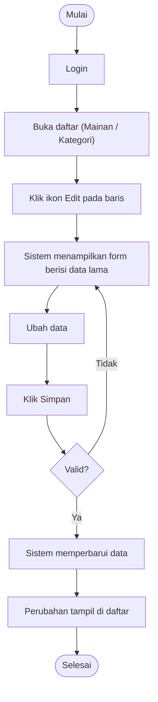

---

## Gambar 3.11 & 3.16 — Activity Diagram Admin: Menghapus Data (Mainan / Kategori)

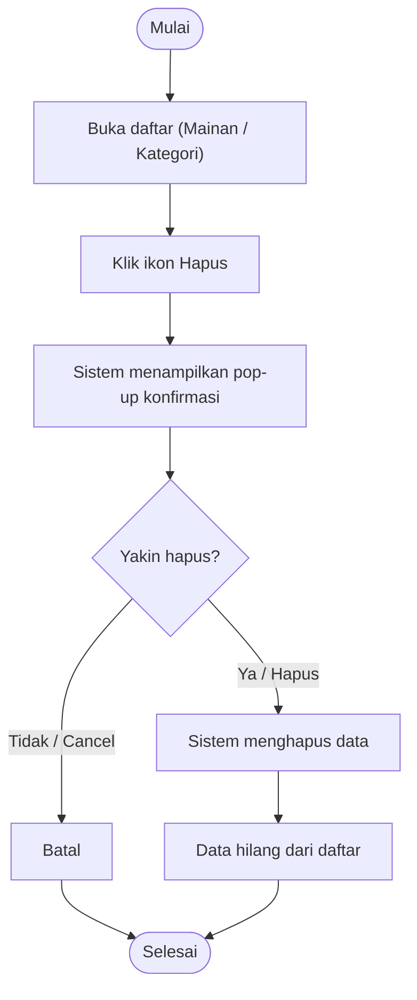

---

## Gambar 3.12 — Activity Diagram Admin: Aktif / Nonaktif Status Mainan

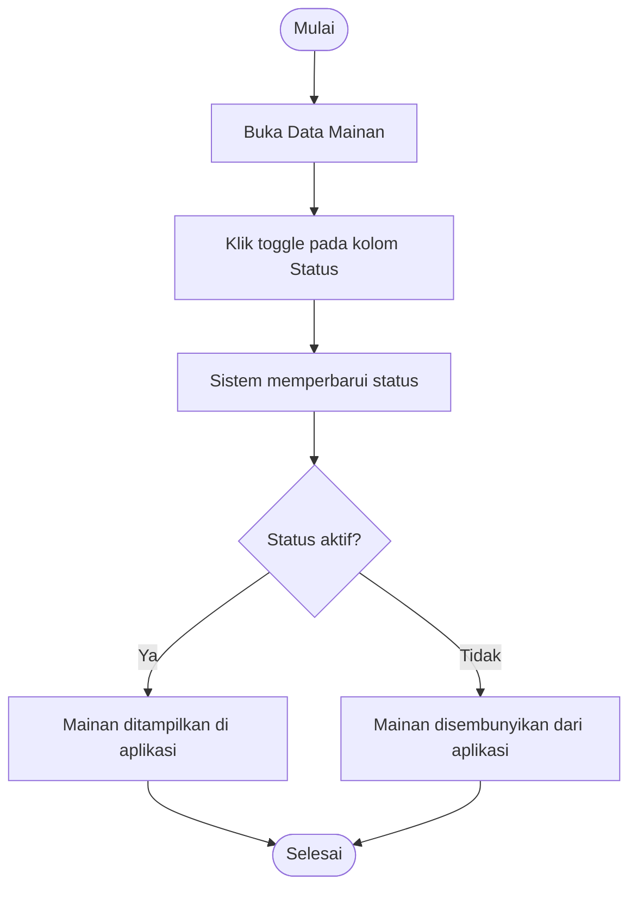

---

## Gambar 3.13 — Activity Diagram Admin: Export Data ke Excel

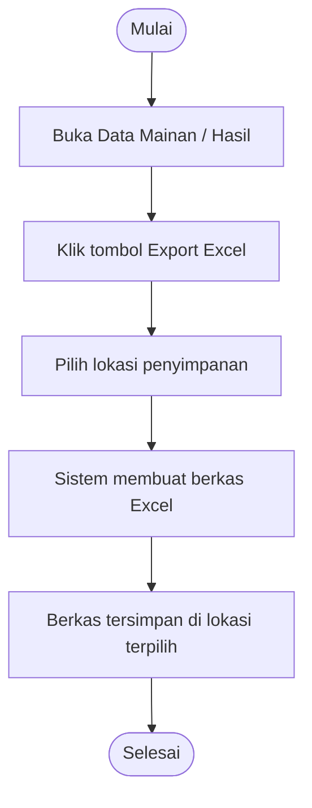

---

## Gambar 3.17 & 3.18 — Activity Diagram Admin: Input Pairwise / Kuesioner Kriteria

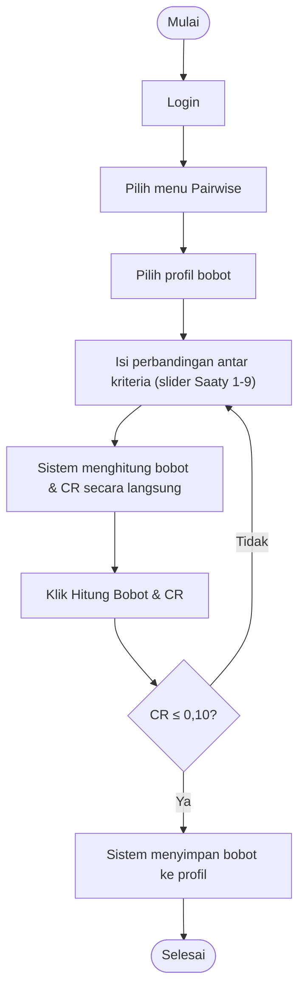

---

## Gambar 3.19 — Activity Diagram Admin: Kalkulasi & Publikasi AHP-SAW

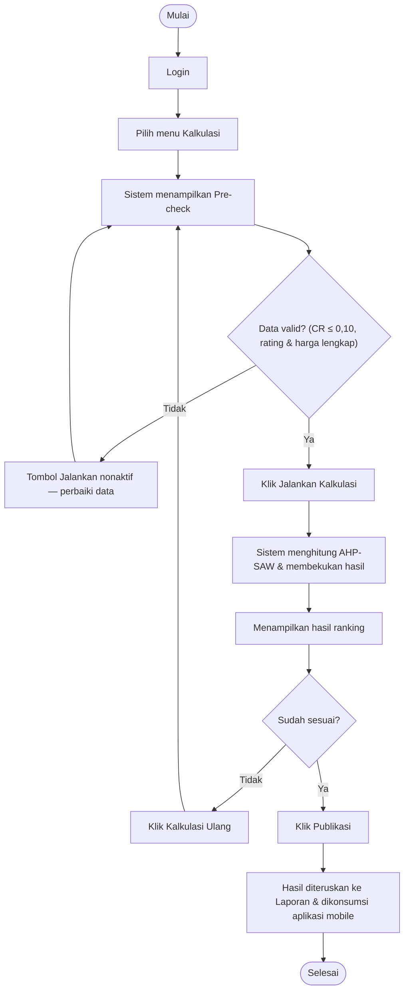

---

## Gambar 3.20 — Activity Diagram Admin: Mengubah Profil Saya

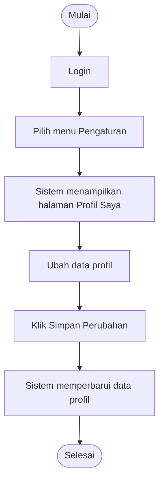

---

## Gambar 3.21 — Activity Diagram Admin: Mengubah Kata Sandi

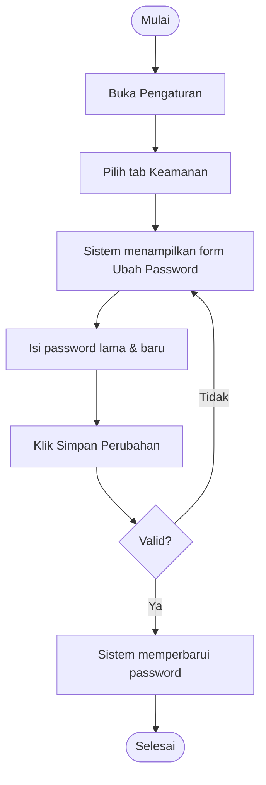

---

## Gambar 3.22 — Rancangan Basis Data (ERD)

> ERD lengkap 15 tabel. Legenda: `||--o{` = relasi FK (satu-ke-banyak, cascade);
> `||..o{` = tautan lunak lewat kolom `code` (dijaga aplikasi). Rincian kolom ada di `DATABASE.md`.

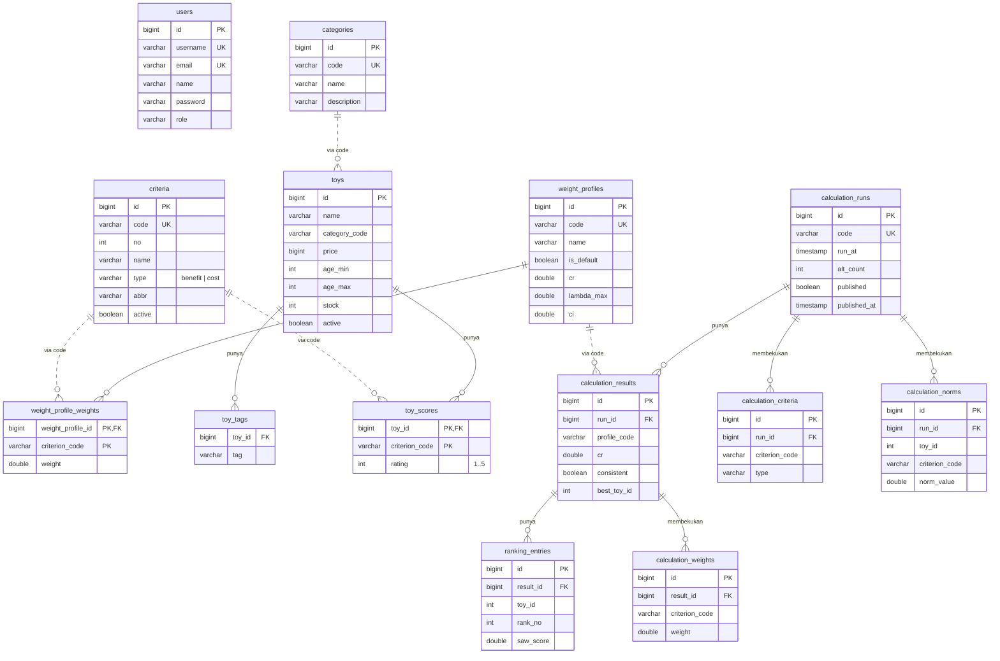

---

# Diagram Tambahan (disarankan untuk memperkuat Bab III)

## T-1 — Arsitektur Sistem

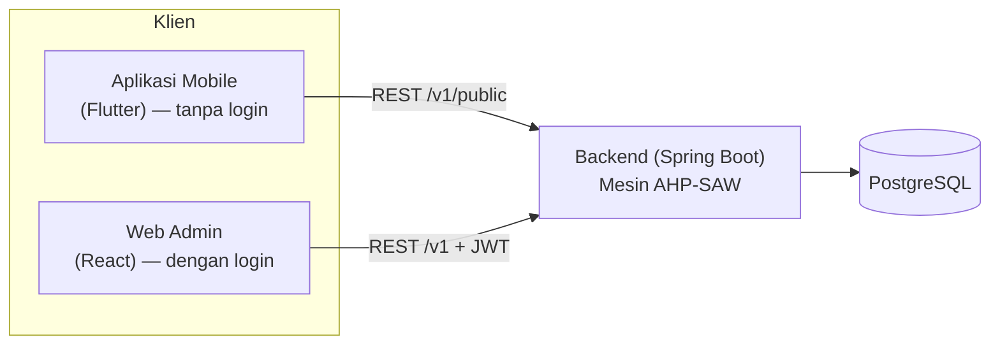

## T-2 — Flowchart Algoritma AHP-SAW

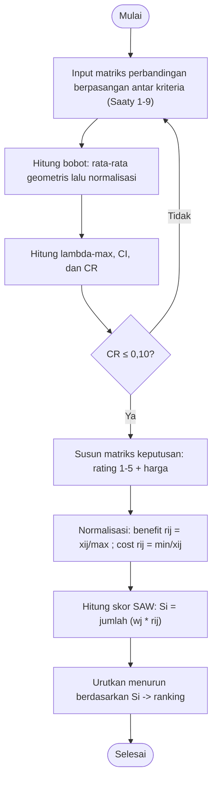

## T-3 — Sequence Diagram: Kalkulasi & Publikasi (Admin)

```mermaid
sequenceDiagram
    actor Admin
    participant Web as Web Admin
    participant API as Backend (AHP-SAW)
    participant DB as PostgreSQL
    Admin->>Web: Buka menu Kalkulasi
    Web->>API: GET pre-check
    API->>DB: Ambil kriteria, bobot, mainan
    DB-->>API: Data
    API-->>Web: Status valid / tidak
    Admin->>Web: Jalankan Kalkulasi
    Web->>API: POST /calculations/run
    API->>API: Normalisasi + skor SAW
    API->>DB: Simpan hasil + snapshot beku
    Admin->>Web: Publikasi
    Web->>API: POST /calculations/{id}/publish
    API->>DB: Set published = true
    API-->>Web: Berhasil
```

## T-4 — Sequence Diagram: Rekomendasi (User / Mobile)

```mermaid
sequenceDiagram
    actor User
    participant App as Aplikasi Mobile
    participant API as Backend
    participant DB as PostgreSQL
    User->>App: Isi kuesioner (usia, budget, tujuan, prioritas)
    App->>API: POST /public/recommend
    API->>DB: Ambil snapshot terpublish (bobot + skor beku)
    DB-->>API: Data
    API->>API: Filter usia/budget + urutkan skor SAW
    API-->>App: Daftar rekomendasi
    App-->>User: Menampilkan hasil rekomendasi
```
